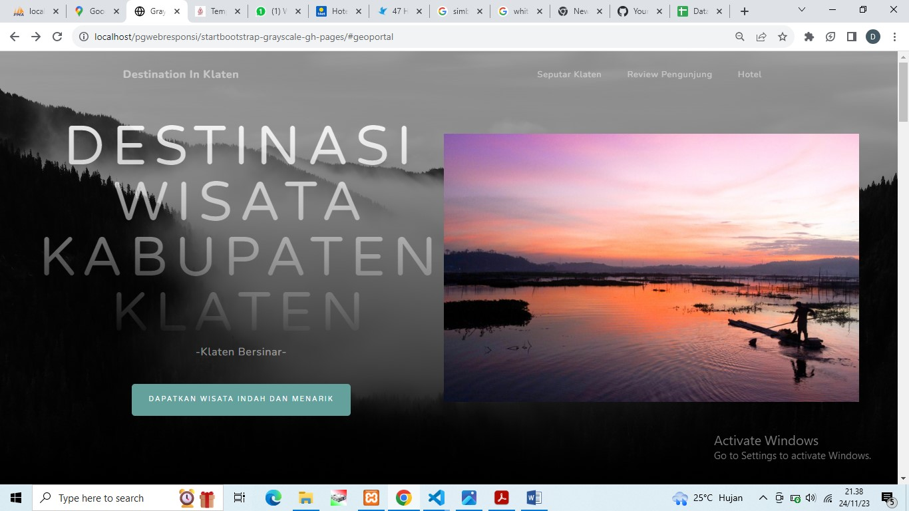
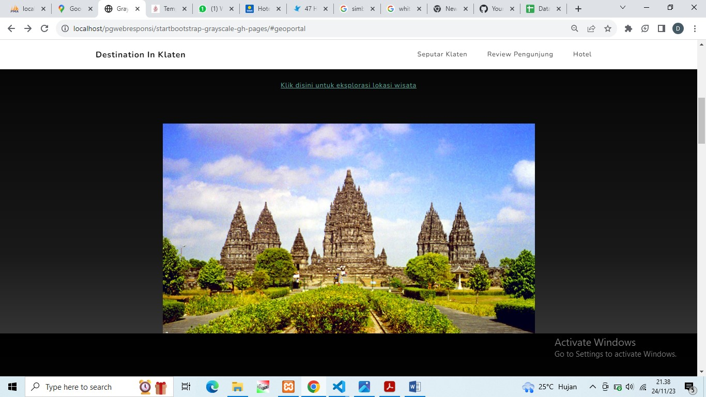
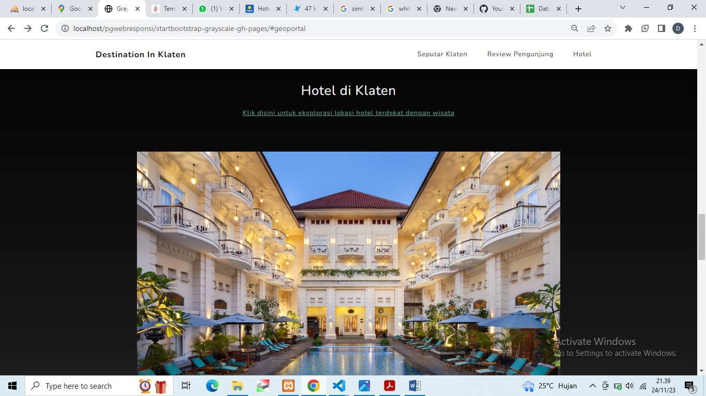
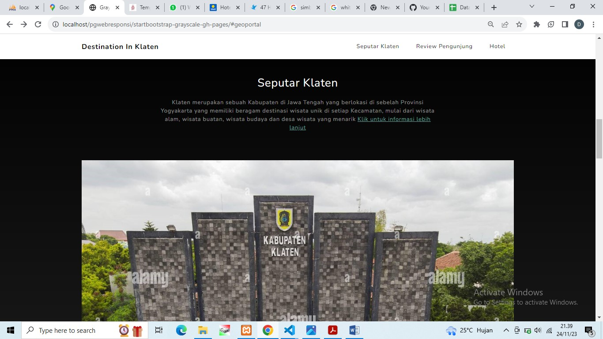
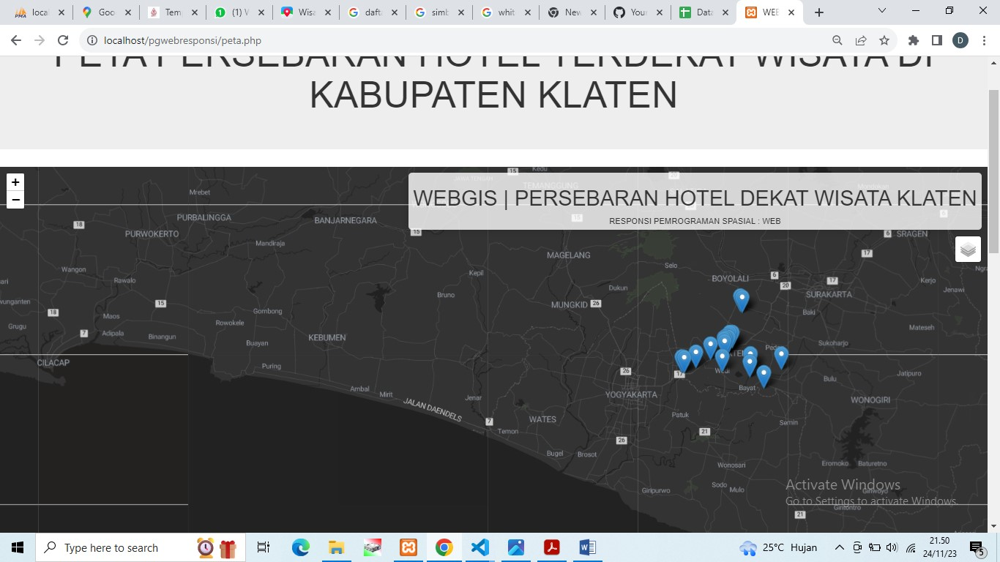
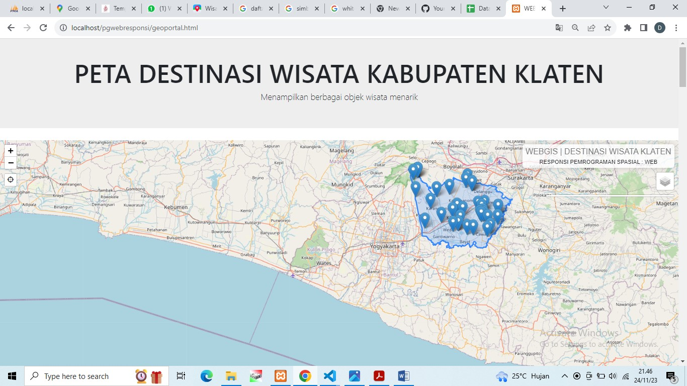
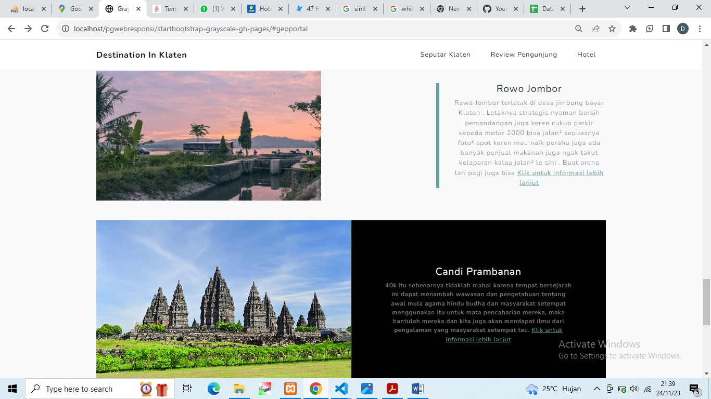
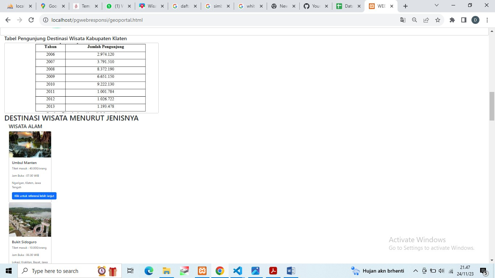
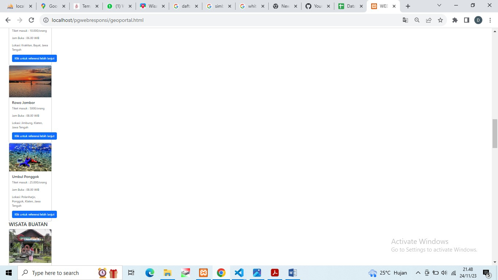
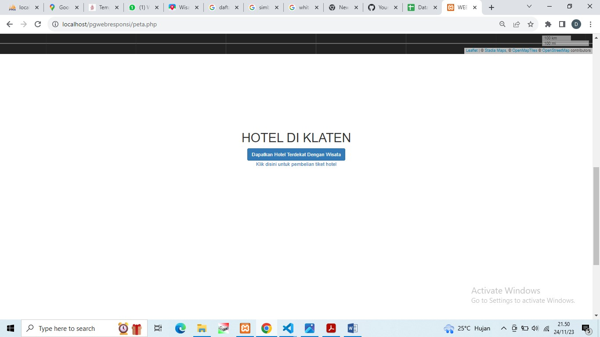

# responsipgweb

# Nama Produk : PETA DESTINASI WISATA KABUPATEN KLATEN

## Deskripsi Produk

 Peta Destinasi Wisata Kabupaten laten adalah website yang berisi seputar lokasi wisata di Kabupaten Klaten menurut jenisnya, yaitu wisata alam, wisata buatan, desa wisata dan wisata budaya yang dibahasa secara detail setiap objek wisata yang popular untuk menarik minat calon pengujung. Selain menampilkan area kajian Kabupaten Klaten dan titik lokasi wisata, terdapat juga peta persebaran hotel yang bertujuan untuk melengkapi sebagian keperluan calon pengujung yang membutuhkan tempat tinggal sementara ketika akan berkunjung di destinasi wisata Kabupaten Klaten. 

## Komponen Pembangun Produk

1. **PHP** Berperan untuk menampilkan shapefile poligon dari geoportal dan struktur page website.
2. **HTML** Berperan untuk penyusunan tampilan halaman website.
3. **Bootstrap** Berperan untuk pengaturan tampilan yang interaktif melalui source code dalam pengembangan peta.
4. **Geoportal** Berperan untuk sumber tersedianya berbagai data geospasial area, titik dan garis.
5. **CSS** Pengaturan properti setiap komponen UI agar menarik.
6. **phpMyAdmin** Berperan untuk penuisan serta penyimpanan database nama wisata beserta koordinatnya secarapesifik untuk dipanggil melalui (*php) dantiitknya  ditampilkan pada peta.
7. **Leaflet.js** Pusataka javascript yang berperan untuk mengembangkan peta yang menarik.
8. **Visual Code** Untuk penyusunan source code keseluruhan.

## Sumber Data
1. **Data seputar Klaten** [https://klatenkab.bps.go.id/publication/2022/02/25/87d9e9c7356ad4ce4872b70f/kabupaten-klaten-dalam-angka-2022.html], [https://klatenkab.go.id/]
2. **Data titik wisata** [https://klateninfo.com/tourism-object/], [https://youtu.be/JczXwnH3VLM?feature=shared], [https://travel.kompas.com/read/2023/05/16/232723927/40-tempat-wisata-klaten-lengkap-ada-candi-dan-umbul?page=all] dan Google MyMaps.
3. **Data titik persebaran hotel** [https://www.traveloka.com/id-id/hotel/indonesia/city/klaten-106797] dan Google MyMaps.

## Tangkapan Layar Komponen Penting Produk
1. **Tampilan landing page**
 

2. **Penjelas dan buton menuju peta**
 

3. **Deskripsi Klaten Secara Umum**

4. **Deskripsi Klaten Secara Umum**
 
 

5. **Tampilan Komentar Pengujung**

6. **Penjelasan beserta gambar masing-masing objek wisata**
 

7. **Tabel Jumlah Lokasi Tiap Kecamatan**

8. **Pemesanan Tiket Hotel**
 

